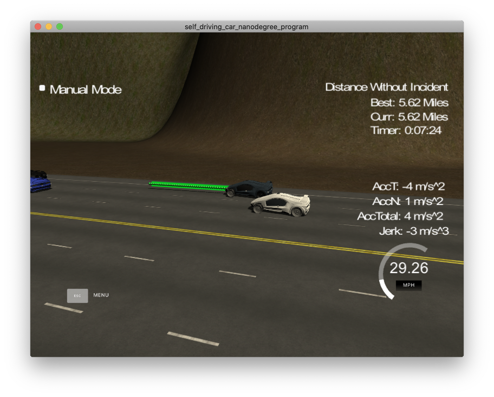

# CarND-Path-Planning-Project
Self-Driving Car Engineer Nanodegree Program

[Model Details available here!](#model)
   
### Simulator.
You can download the Term3 Simulator which contains the Path Planning Project from the [releases tab (https://github.com/udacity/self-driving-car-sim/releases/tag/T3_v1.2).  

To run the simulator on Mac/Linux, first make the binary file executable with the following command:
```shell
sudo chmod u+x {simulator_file_name}
```

### Goals
In this project your goal is to safely navigate around a virtual highway with other traffic that is driving +-10 MPH of the 50 MPH speed limit. You will be provided the car's localization and sensor fusion data, there is also a sparse map list of waypoints around the highway. The car should try to go as close as possible to the 50 MPH speed limit, which means passing slower traffic when possible, note that other cars will try to change lanes too. The car should avoid hitting other cars at all cost as well as driving inside of the marked road lanes at all times, unless going from one lane to another. The car should be able to make one complete loop around the 6946m highway. Since the car is trying to go 50 MPH, it should take a little over 5 minutes to complete 1 loop. Also the car should not experience total acceleration over 10 m/s^2 and jerk that is greater than 10 m/s^3.

#### The map of the highway is in data/highway_map.txt
Each waypoint in the list contains  [x,y,s,dx,dy] values. x and y are the waypoint's map coordinate position, the s value is the distance along the road to get to that waypoint in meters, the dx and dy values define the unit normal vector pointing outward of the highway loop.

The highway's waypoints loop around so the frenet s value, distance along the road, goes from 0 to 6945.554.

## Basic Build Instructions

1. Clone this repo.
2. Make a build directory: `mkdir build && cd build`
3. Compile: `cmake .. && make`
4. Run it: `./path_planning`.

Here is the data provided from the Simulator to the C++ Program

#### Main car's localization Data (No Noise)

["x"] The car's x position in map coordinates

["y"] The car's y position in map coordinates

["s"] The car's s position in frenet coordinates

["d"] The car's d position in frenet coordinates

["yaw"] The car's yaw angle in the map

["speed"] The car's speed in MPH

#### Previous path data given to the Planner

//Note: Return the previous list but with processed points removed, can be a nice tool to show how far along
the path has processed since last time. 

["previous_path_x"] The previous list of x points previously given to the simulator

["previous_path_y"] The previous list of y points previously given to the simulator

#### Previous path's end s and d values 

["end_path_s"] The previous list's last point's frenet s value

["end_path_d"] The previous list's last point's frenet d value

#### Sensor Fusion Data, a list of all other car's attributes on the same side of the road. (No Noise)

["sensor_fusion"] A 2d vector of cars and then that car's [car's unique ID, car's x position in map coordinates, car's y position in map coordinates, car's x velocity in m/s, car's y velocity in m/s, car's s position in frenet coordinates, car's d position in frenet coordinates. 

## Details

1. The car uses a perfect controller and will visit every (x,y) point it recieves in the list every .02 seconds. The units for the (x,y) points are in meters and the spacing of the points determines the speed of the car. The vector going from a point to the next point in the list dictates the angle of the car. Acceleration both in the tangential and normal directions is measured along with the jerk, the rate of change of total Acceleration. The (x,y) point paths that the planner recieves should not have a total acceleration that goes over 10 m/s^2, also the jerk should not go over 50 m/s^3. (NOTE: As this is BETA, these requirements might change. Also currently jerk is over a .02 second interval, it would probably be better to average total acceleration over 1 second and measure jerk from that.

2. There will be some latency between the simulator running and the path planner returning a path, with optimized code usually its not very long maybe just 1-3 time steps. During this delay the simulator will continue using points that it was last given, because of this its a good idea to store the last points you have used so you can have a smooth transition. previous_path_x, and previous_path_y can be helpful for this transition since they show the last points given to the simulator controller with the processed points already removed. You would either return a path that extends this previous path or make sure to create a new path that has a smooth transition with this last path.


## Dependencies

* cmake >= 3.5
  * All OSes: [click here for installation instructions](https://cmake.org/install/)
* make >= 4.1
  * Linux: make is installed by default on most Linux distros
  * Mac: [install Xcode command line tools to get make](https://developer.apple.com/xcode/features/)
  * Windows: [Click here for installation instructions](http://gnuwin32.sourceforge.net/packages/make.htm)
* gcc/g++ >= 5.4
  * Linux: gcc / g++ is installed by default on most Linux distros
  * Mac: same deal as make - [install Xcode command line tools]((https://developer.apple.com/xcode/features/)
  * Windows: recommend using [MinGW](http://www.mingw.org/)
* [uWebSockets](https://github.com/uWebSockets/uWebSockets)
  * Run either `install-mac.sh` or `install-ubuntu.sh`.
  * If you install from source, checkout to commit `e94b6e1`, i.e.
    ```
    git clone https://github.com/uWebSockets/uWebSockets 
    cd uWebSockets
    git checkout e94b6e1
    ```

<a name="model"/>

## Model Documentation

Path Planning refers to generating safe and drivable path for a vehicle to reach its goal. It consists of 3 parts.
1. [Prediction](#p)
2. [Behaviour Planning](#b)
3. [Trajectory Generation](#t)



<a name="p"/>

### 1. Prediction

The **prediction** is based on the information of other vehicles from the sensor fusion in the helper.h file from line 162-190. It first filter the vehicles within 100m from the ego vehicle, then use the predicted neighbouring vehicles end locations based on the same direction and speed to see if there are vehicles in the front in the same lane, in the left lane and right lane.

```
vector<double> get_predictions(vector<vector<double>> sensor_fusion, int prev_size, double car_s, int lane){
  bool car_left = false;
  bool car_front = false;
  bool car_right = false;
  double front_speed;
  for(int i = 0; i < sensor_fusion.size(); i++){
    double check_car_s = sensor_fusion[i][5];
    // filter the cars that are too far from the ego car
    if(abs(check_car_s - car_s) < 100){
      double check_car_d = sensor_fusion[i][6];
      int check_car_lane = get_lane(check_car_d);
      // check if the car in front is too close
      double check_car_vx = sensor_fusion[i][3];
      double check_car_vy = sensor_fusion[i][4];
      double check_car_speed = sqrt(pow(check_car_vx, 2) + pow(check_car_vy, 2));
      check_car_s = check_car_s + prev_size * T * check_car_speed;
      if(check_car_lane == lane){
        if((check_car_s > car_s) && (check_car_s < car_s + MIN_DIST)){
          car_front = true;
          front_speed = check_car_speed; // m/s
        }
      } else {
        if((check_car_lane == lane - 1) && (check_car_s > car_s && (check_car_s - car_s) < 40 ||  check_car_s < car_s && (car_s - check_car_s ) < MIN_DIST)|| lane == 0)
          car_left = true;
        if((check_car_lane == lane + 1) && (check_car_s > car_s && (check_car_s - car_s) < 40 ||  check_car_s < car_s && (car_s - check_car_s ) < MIN_DIST)|| lane == 2)
          car_right = true;
      }
    }
  }

  return {(double)car_left, (double)car_right, (double)car_front, front_speed};
}
```
<a name="b"/>

### 2. Behaviour Planning

The **behaviour planning** is based on the predictions. When there is no car in the front in the same lane, it can drive at 49.5 mph. Otherwise it can choose to stay in the same lane, change to left or right if allowed. This can be done by a finite state machine (FSM) but I simply used a vector of chosen lane and reference velocity to represent the states "keep lane", "lane change to left" and "lane change to right". It will generate a list of choices.

```
vector<std::pair<int, double>> behaviour_planning(bool car_left, bool car_right, bool car_front, int lane, double ref_vel, double front_speed){
  vector<std::pair<int, double>> successor_lanes_ref_vels;
  if(car_front){
    successor_lanes_ref_vels.push_back(std::make_pair(lane, ref_vel - 5 * T));
    if(!car_left)
      successor_lanes_ref_vels.push_back(std::make_pair(std::max(lane - 1, 0), std::min(MAX_VEL/MAX_ACC, ref_vel + 5 * T)));
    if(!car_right)
      successor_lanes_ref_vels.push_back(std::make_pair(std::min(lane + 1, 2), std::min(MAX_VEL/MAX_ACC, ref_vel + 5 * T)));
  }

  if(!car_front){
    successor_lanes_ref_vels.push_back(std::make_pair(lane, std::min(MAX_VEL/MAX_ACC, ref_vel + 8 * T)));
  }
  return successor_lanes_ref_vels;
}

```
<a name="t"/>
  
### 3. Trajectory Generation  

Then the **trajectory** shall be generated and the cost of the trajectory should be calculated and compared to find the least-cost trajectory. I followed the Q&A guide video in the project and used the Spline to generate smooth trajectories. I calculated the cost for each choice between lines 211 and 236. In the calculation, I only considered the lane change, speed limit, and acceleration.

```
vector<vector<double>> choose_trajectory(int lane, double ref_vel, double car_x, double car_y, double car_yaw, double car_s, double car_d,const vector<double> &map_waypoints_s, const vector<double> &map_waypoints_x, const vector<double> &map_waypoints_y,vector<double> previous_path_x, vector<double> previous_path_y ){

  int prev_size = previous_path_x.size();
  double ref_x = car_x;
  double ref_y = car_y;
  double ref_yaw = deg2rad(car_yaw);
  vector<double> ptsx;
  vector<double> ptsy;
  // find two points in the past
  if ( prev_size < 2 ) {    //Use two points thats makes path tangent to the car
    double prev_car_x = car_x - cos(car_yaw);
    double prev_car_y = car_y - sin(car_yaw);    
    ptsx.push_back(prev_car_x);
    ptsx.push_back(car_x);    

    ptsy.push_back(prev_car_y);
    ptsy.push_back(car_y);
  }else{
    //Redefine the reference point to previous point
    ref_x = previous_path_x[prev_size - 1];
    ref_y = previous_path_y[prev_size - 1];
    double ref_x_prev = previous_path_x[prev_size - 2];
    double ref_y_prev = previous_path_y[prev_size - 2];
    ref_yaw = atan2(ref_y-ref_y_prev, ref_x-ref_x_prev);
    ptsx.push_back(ref_x_prev);
    ptsx.push_back(ref_x);

    ptsy.push_back(ref_y_prev);
    ptsy.push_back(ref_y); 
  }
  // find another 3 points in the future
  for(int i = 1; i <4; i++){
    vector<double> next_wp = getXY(car_s + MIN_DIST*i, 2 + 4*lane, map_waypoints_s, map_waypoints_x, map_waypoints_y);
    ptsx.push_back(next_wp[0]);
    ptsy.push_back(next_wp[1]);
  }
  // shift to car coordinates
  for(int i=0; i <ptsx.size(); i++){
    double shift_x = ptsx[i] - ref_x;
    double shift_y = ptsy[i] - ref_y;

    ptsx[i] = (shift_x*cos(-ref_yaw) - shift_y*sin(-ref_yaw));
    ptsy[i] = (shift_x*sin(-ref_yaw) + shift_y*cos(-ref_yaw));
  }
  // build the spline based on the 5 points
  tk::spline s;
  s.set_points(ptsx, ptsy);

  vector<double> next_x_vals;
  vector<double> next_y_vals;
  //For the smooth transition, we are adding previous path points
  for ( int i = 0; i < prev_size; i++ ) {
    next_x_vals.push_back(previous_path_x[i]);
    next_y_vals.push_back(previous_path_y[i]);
  }

  double target_x = 30.0;
  double target_y = s(target_x);
  double target_dist = sqrt(target_x*target_x + target_y*target_y);

  double x_add_on = 0;

  for( int i = 1; i < 50 - prev_size; i++ ) {

    double N = target_dist/(T*ref_vel);
    double x_point = x_add_on + target_x/N;
    double y_point = s(x_point);

    x_add_on = x_point;

    double x_ref = x_point;
    double y_ref = y_point;

    //Rotate back to normal after rotating it earlier
    x_point = x_ref * cos(ref_yaw) - y_ref * sin(ref_yaw);
    y_point = x_ref * sin(ref_yaw) + y_ref * cos(ref_yaw);

    x_point += ref_x;
    y_point += ref_y;

    next_x_vals.push_back(x_point);
    next_y_vals.push_back(y_point);
  }
  vector<vector<double>> next_vals;
  next_vals.push_back(next_x_vals);
  next_vals.push_back(next_y_vals);

  return next_vals;
}
```

###Results


Or to checkout the results, you can also see the recording of the project
